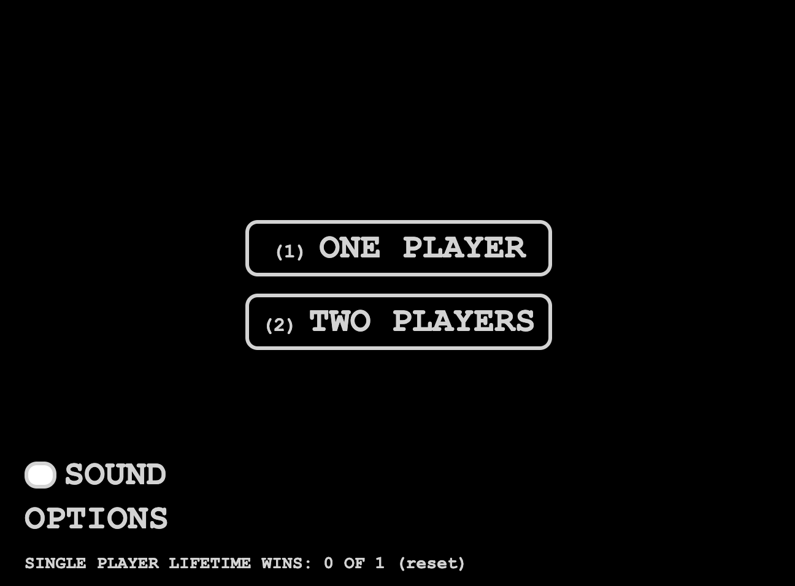
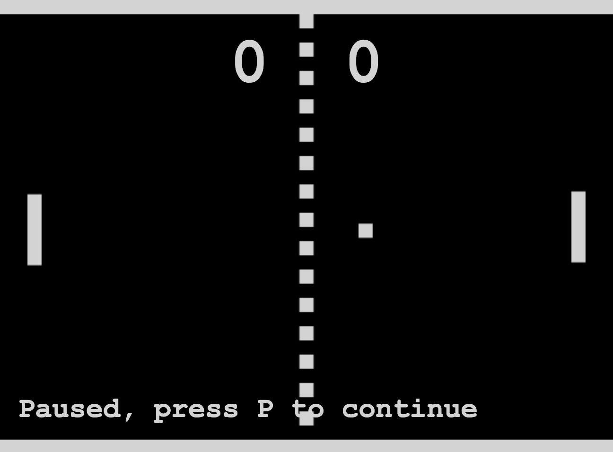

# 42-transcendance

+ TODO Make a diagram showing where each options in the menu leads.
+ TODO Design each of those screens and add them to the diagram.
+ TODO Add a more thorough description of each major game mode.

# Game

## Description
### Graphics
+ Retro-style, bi-color, uses the same colors as the rest of the website.
  Use high contrast color scheme.

### Sound
+ Small jingle at the start of a match.
+ "Electronic" bouncing sound when the ball hit a paddle or a wall.
+ Win and lose jingles.

### Gameplay
+ On desktop keyboard only, no mouse support. On mobile / tablet touch, add
  on-screen joystick or movepad.
+ Ball slower during serve.
+ Alternate service after each point.
+ First player to 10 points, no margin required i.e 9-10 is a valid final score.
+ Game modes: vs AI, vs Human local, vs Human online, Tournament

### AI
+ No difficulty settings.
+ AI can only refresh its view of the game once per second, requiring it to
  anticipate bounces and other actions.

### Tournament
+ Allow for 4, 8 or 16 players.
+ Players are paired randomly, play their game, loser is removed from the
  tournament while winner moves on to the next round and so on.
+ Sudden-death tournament i.e single match, loser is removed from the
  tournament. This implies no draws are possible.
+ Standard scoring rule i.e first to 10 with no margin.

### Matchmaking
+ No ranking or rating system.
+ Queue system
  + If a player wants to play but no one is in the queue, he goes in the queue.
  + When a new player arrives he is matched with the one that was in the queue.

# Frontend
## Features
## Technolgy used
## Description

# Modules

## Web
+ [x] Major module: Use a Framework as backend.
+ [x] Minor module: Use a front-end framework or toolkit.
+ [x] Minor module: Use a database for the backend.
+ [x] Major module: Store the score of a tournament in the Blockchain.

## User Management
+ [ ] Major module: Standard user management, authentication, users across tournaments.
+ [ ] Major module: Implementing a remote authentication.

## Gameplay and user experience
+ [x] Major module: Remote players
+ [ ] Major module: Multiplayers (more than 2 in the same game).
+ [ ] Major module: Add Another Game with User History and Matchmaking.
+ [ ] Minor module: Game Customization Options.
+ [ ] Major module: Live chat.

## IA-Algo
+ [x] Major module: Introduce an AI Opponent.
+ [ ] Minor module: User and Game Stats Dashboards

## Cybersecurity
+ [ ] Major module: Implement WAF/ModSecurity with Hardened Configuration and HashiCorp Vault for Secrets Management.
+ [ ] Minor module: GDPR Compliance Options with User Anonymization, Local Data Management, and Account Deletion.
+ [ ] Major module: Implement Two-Factor Authentication (2FA) and JWT.

## Devops
+ [ ] Major module: Infrastructure Setup for Log Management.
+ [x] Minor module: Monitoring system.
+ [x] Major module: Designing the Backend as Microservices.

## Graphics
+ [x] Major module: Use of advanced 3D techniques.

## Accessibility
+ [x] Minor module: Support on all devices.
+ [x] Minor module: Expanding Browser Compatibility.
+ [ ] Minor module: Multiple language supports.
+ [ ] Minor module: Add accessibility for Visually Impaired Users.
+ [ ] Minor module: Server-Side Rendering (SSR) Integration.

## Object oriented
+ [ ] Major module: Replacing Basic Pong with Server-Side Pong and Implementing an API.
+ [ ] Major module: Enabling Pong Gameplay via CLI against Web Users with API Integration.

